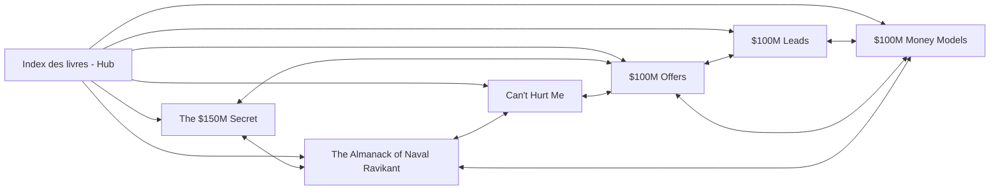

---
tags:
  - index
  - livres
statut: a jour
derniere-maj: 2026-08-04
---

# Index des Livres

Livres générés à partir des livres de la bibliothèque.
Régénération via le skill `livre-bible` (scripts d'extraction et de découpage dans `scripts/`).

## Règles des notes de livre

- Nom : `X.md` (le titre du livre, sans suffixe), une note par livre
- **Exhaustives** : pas de limite de longueur - une note de livre couvre tout le livre, chapitre par chapitre
- **Citations verbatim** : une citation se reproduit telle quelle, jamais reformulée. Un chiffre douteux du livre est reproduit et marqué [I]/[C]/[D] plutôt que corrigé en silence
- Marqueurs de confiance : les faits du livre sont des [F] (faits du livre), les interprétations des [D]/[H]
- Frontmatter : `tags`, `statut`, `titre`, `derniere-maj`
- Liens : chaque note de livre a une section "Aller plus loin" vers les notes liées + une entrée dans ce hub et dans les index ([[Concepts]], [[Accueil]])
- Chiffres datés du livre (ex. ARR 2022) : marqués comme datés, jamais présentés comme actuels

## Le réseau

## Les livres

| Titre | Auteur | Thème | Cluster |
|---|---|---|---|
| [[$100M Offers]] | Alex Hormozi | L'offre irrésistible (Value Equation, Grand Slam Offer) | Hormozi |
| [[$100M Leads]] | Alex Hormozi | Trouver des clients (Rule of 100, cold outreach) | Hormozi |
| [[$100M Money Models]] | Alex Hormozi | Modèles économiques et monétisation | Hormozi |
| [[The $150M Secret]] | Guillaume Moubeche | Bootstrapping, profitabilité, "Marco Polo principle" | Business |
| [[The Almanack of Naval Ravikant]] | Eric Jorgenson | Richesse, leverage, philosophie du désir | Business / mindset |
| [[Can't Hurt Me]] | David Goggins | Discipline, souffrance, dépassement de soi | Mindset |

**Bibliothèque business : ~58 000 mots** [C - toutes les notes de livre du vault, compté par `wc -w` le 04/08/2026].

## Priorités

1. **Hormozi** : `$100M Offers` · `$100M Leads` · `$100M Money Models`
2. `The $150M Secret` (Guillaume Moubeche)
3. `The Almanack of Naval Ravikant` + `Can't Hurt Me` (le mental d'exécution)
